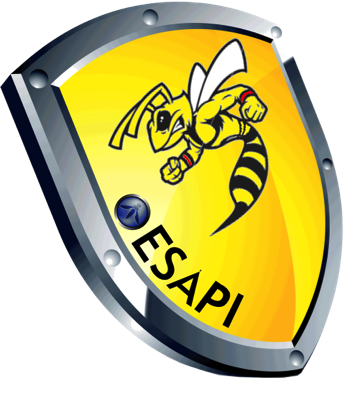

## Downloads

**NOTE** - Use of links to vendor specific ESAPI presentations does not constitute an
endorsement of that vendor by either the OWASP Foundation, nor by ESAPI contributors.

### About ESAPI
* Data sheet - [PDF](https://owasp.org/www-pdf-archive/Esapi-datasheet.pdf), [Word](http://wiki.owasp.org/images/3/32/Esapi-datasheet.doc)
* Project presentation [Slide deck](https://www.denimgroup.com/media/pdfs/DenimGroup_ESAPI_SATJUG_20100603.pdf)
* Video presentations -- [YouTube videos on ESAPI](https://www.youtube.com/results?search_query=OWASP+ESAPI)

### Get ESAPI
* [ESAPI for Java Downloads (binaries)](https://search.maven.org/#search%7Cga%7C1%7Cesapi)
* [ESAPI for Java (source)](https://github.com/ESAPI/esapi-java-legacy)
* **DEPRECATED** - [ESAPI for JavaScript](https://github.com/ESAPI/owasp-esapi-js)
* [ESAPI for NodeJS](https://github.com/ESAPI/node-esapi) - a minimal port of "ESAPI for JavaScript" for use with Node.js

#### Unsupported versions

The following flavors of ESAPI are no longer supported by OWASP. If you absolutely need to download one of those, it is suggested that you search the [Internet Archive Wayback Machine](https://archive.org/) or perhaps [GitHub](https://github.com/) for someone who may have mirrored it:
* ESAPI for .NET
* ESAPI for Classic ASP
* ESAPI for PHP
* ESAPI for ColdFusion &amp; CFML (May still be supported by Adobe; also appears to be mirrored [here](https://github.com/damonmiller/esapi4cf) on GitHub.)
* ESAPI for Python

### Learn ESAPI
* ESAPI design patterns (not language-specific): [PDF](http://wiki.owasp.org/images/8/82/Esapi-design-patterns.pdf), [Word](http://wiki.owasp.org/index.php/File:Esapi-design-patterns.doc), [PPT](http://wiki.owasp.org/images/8/87/Esapi-design-patterns.ppt)
* [ESAPI Swingset](https://wiki.owasp.org/index.php/ESAPI_Swingset) -- a sample application that demonstrates how to leverage ESAPI to protect a web application. (Uses ESAPI4Java 1.4.)
* [LAMP should be spelled LAMPE](https://owasp.org/www-pdf-archive/LAMP_Should_be_Spelled_LAMPE.pdf)
* [ESAPI for Java interface documentation (Javadoc)](https://www.javadoc.io/doc/org.owasp.esapi/esapi/latest/index.html)
